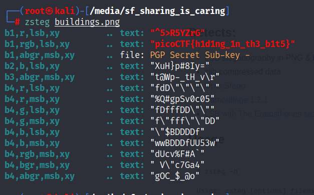
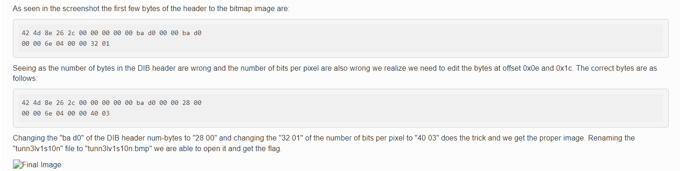

# CTF Mindset: Image CTF

# Image CTF:

## Different Types of Image CTFS:

## Check the FILE:

```powershell
file <file>
```

## EXIF data:

```powershell
exiftool <image>

change the comment to Base64
```

## Image inside image inside image …

- to get the details of the image

```powershell
exiftool <image>
```

- to extract the data out of it: (extract other data.)

```powershell
foremost <image>
```

- using binwalk to extract the files
    
    ```powershell
    binwalk -e <image>
    ```
    
- Strings:
    
    ```powershell
    strings -n 8 <image>
    
    // monitor very carefully
    ```
    

## Changing the Hexvalue:

- use hexeditor
- use bless

## IF PNG is compressed with zlib: found by binwalk:

```powershell
zsteg <image>

zsteg -a <image>
```



## USE steghide to extract the message:

```powershell
steghide extract -sf stegosteg.jpg
```

## Hexeditor:

- BMP file:
    - [https://ctftime.org/writeup/28157](https://ctftime.org/writeup/28157)
    
    
    

## Online TOOL:

- [https://29a.ch/photo-forensics/#forensic-magnifier](https://29a.ch/photo-forensics/#forensic-magnifier)

## PNG Check - Correct:

- [https://hackmd.io/@FlsYpINbRKixPQQVbh98kw/Sk_lVRCBr](https://hackmd.io/@FlsYpINbRKixPQQVbh98kw/Sk_lVRCBr)
- [https://gist.github.com/Drakota/e17f4e8a1b6f30292acd442dda9d3565](https://gist.github.com/Drakota/e17f4e8a1b6f30292acd442dda9d3565)
- [https://ctftime.org/writeup/14396](https://ctftime.org/writeup/14396)
- [https://hackmd.io/@FlsYpINbRKixPQQVbh98kw/Bk9Wj63vH](https://hackmd.io/@FlsYpINbRKixPQQVbh98kw/Bk9Wj63vH)
- [https://ctf-wiki.mahaloz.re/misc/picture/png/](https://ctf-wiki.mahaloz.re/misc/picture/png/)

## Contributor:
- [princep4 - Github](https://github.com/princep4)

- [PrincePrafull3 -  Twitter](https://twitter.com/PrincePrafull3)
