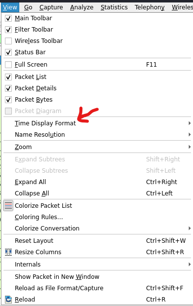

# CTF Mindset: Network Traffic analysis

Status: In progress

# Network Traffic analysis:

## Tools we use:

- Wireshark (recommended)
- Networkminer

## Protocols we should always look forward:

- TCP
- HTTP
- DNS
- ARP
    etc…

### Things to See in HTTP packets:

- Origin
- IP address of websites visited
- HTTP headers
- Type of data sent through HTTP: png,xls,jpeg etc…

### Things to See in DNS packets

- Domain visited by the user

## USB key strocks:

- [https://abawazeeer.medium.com/kaizen-ctf-2018-reverse-engineer-usb-keystrok-from-pcap-file-2412351679f4](https://abawazeeer.medium.com/kaizen-ctf-2018-reverse-engineer-usb-keystrok-from-pcap-file-2412351679f4)

- [https://www.youtube.com/watch?v=JZaivUJL2tw](https://www.youtube.com/watch?v=JZaivUJL2tw)

- [https://blog.stayontarget.org/2019/03/decoding-mixed-case-usb-keystrokes-from.html](https://blog.stayontarget.org/2019/03/decoding-mixed-case-usb-keystrokes-from.html)

- [https://gist.github.com/szymex73/3156e508f24591b64c6b6dd6d009fa57](https://gist.github.com/szymex73/3156e508f24591b64c6b6dd6d009fa57)

- [https://ctf-wiki.mahaloz.re/misc/traffic/protocols/USB/](https://ctf-wiki.mahaloz.re/misc/traffic/protocols/USB/)

- [https://blog.oki.moe/posts/2021/05/nsec21-goldsmiths-guild-part-1/](https://blog.oki.moe/posts/2021/05/nsec21-goldsmiths-guild-part-1/)

## Time Format change to UTC:

- Open pcap in Wireshark
- Visit **View**
    
    
    
- Or just do **CTRL+ATL+7** to display time in the format of **UTC DATE and time**
    
    
    

## Filters we can Apply:

### Frame time filter: apply prepare filter on FRAME header

```powershell
frame.time >= "Sep 24, 2021 16:45:11" && frame.time <= "Sep 24, 2021 16:45:30"
```

# <b> 🪪 Contributors: </b>
- [Prince Prafull](https://www.linkedin.com/in/prince-prafull-19a477194/) 